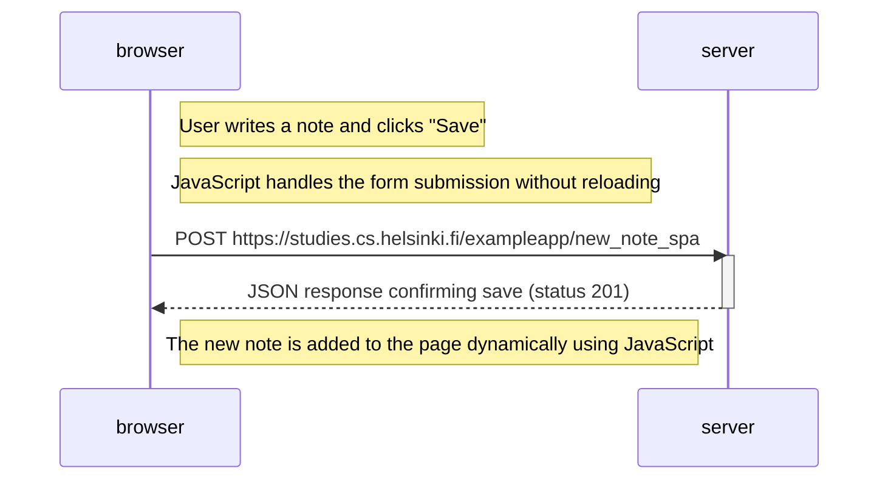

# New Note SPA Version

```mermaid
sequenceDiagram
    participant browser
    participant server

    Note right of browser: User writes a note and clicks "Save"

    Note right of browser: JavaScript handles the form submission without reloading

    browser->>server: POST https://studies.cs.helsinki.fi/exampleapp/new_note_spa
    activate server
    server-->>browser: JSON response confirming save (status 201)
    deactivate server

    Note right of browser: The new note is added to the page dynamically using JavaScript
```